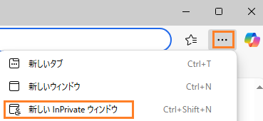

# 1. SecOps へのアクセス

##  ポータルへの接続

---

１．ブラウザでプライベートウィンドウを開きます。

​	【Chromeの場合】右上のメニューボタン（縦の …）  をクリックし、**新しいシークレット ウィンドウ**  をクリックします。	

​	【Edgeの場合】右上の メニューボタン（…） をクリックし、[新しいInPrivate ウィンドウ] をクリックします。

２．イベント主催者から提供された SecOps デモ環境のURLに接続します。接続に成功すると下記のような画面が表示されます。

!!! warning
    宇宙飛行士の絵とともに 4xx エラーが表示された場合は、少し間をおいて再接続してください（この環境へのアカウント登録中の可能性があります）。5 分以上経過してもエラーが改善されない場合は、イベント主催者までお知らせください。

## AI (Gemini) チャット機能の許可

---

３．画面右上の **Gemini アイコン(スパークボタン)** をクリックすると、Gemini チャットウインドウが画面右側に表示されます。

４．**Start Chat**  ボタンをクリックすることで、以後の操作で Gemini の支援が行われるようになります。

５．チャットウィンドウ右上の **アンダーバー(＿)** ボタンをクリックし、チャットを非表示にしておきます。

５．[次のステップ](../02-dashboard) に移動します
