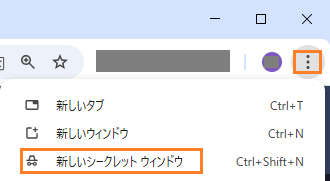
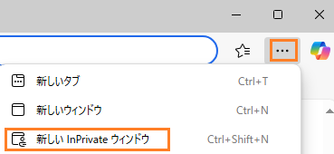
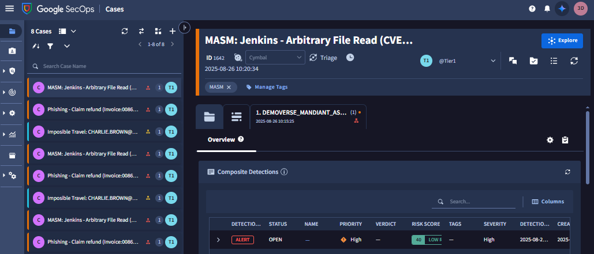

# 1. SecOps へのアクセス

##  ポータルへの接続

---

１．ブラウザでプライベートウィンドウを開きます。

​	【Chromeの場合】右上のメニューボタン（縦の …）  をクリックし、**新しいシークレット ウィンドウ**  をクリックします。	

​	【Edgeの場合】右上の メニューボタン（…） をクリックし、[新しいInPrivate ウィンドウ] をクリックします。

２．イベント主催者から提供された SecOps デモ環境のURLに接続します。接続に成功すると下記画面が表示されます。

３．[次のステップ](../031-search) に移動します
