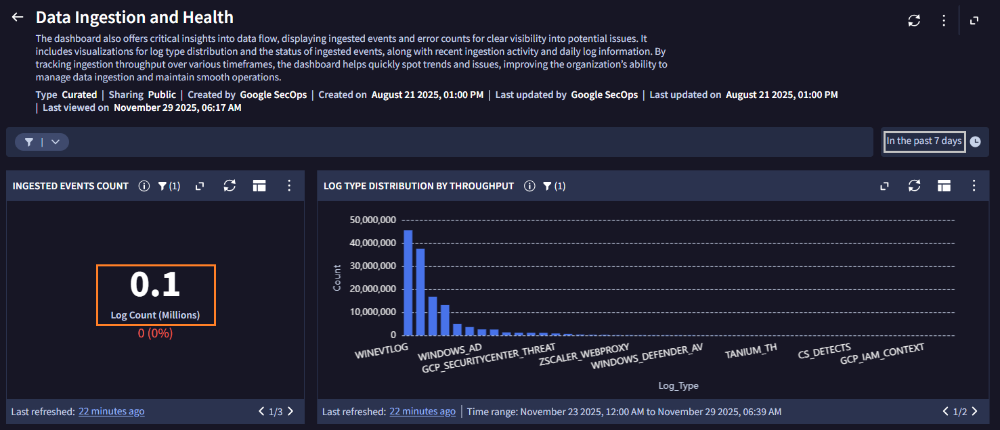
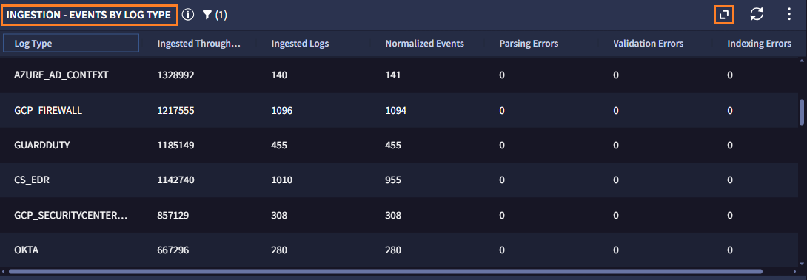

# 1. ログの確認

まず最初に、どのようなログが SecOps に取り込まれているかを確認します。

##  ダッシュボートの表示	

---

１．画面左上のメニューバーから **Dashboards & Reports  > Dashborads** をクリックして、ダッシュボード画面に移動します。

​	

２．ダッシュボードの一覧が表示されます。この中からデータ取り込み状況のダッシュボードを選択します。画面右上の  `Search...` に **Data**  と入力して検索し、 リストから **Data Ingestion and Health** を見つけてクリックしてください。

３．ログ取り込み状況を可視化したダッシュボードが表示されるので内容を確認します。

!!! check
    デフォルトでは過去 1 週間の状況を表示します。このデモ環境では約 10 万件 ( =0.1 millions Log Count)のログが 1 週間で格納されたようです。また、右側のグラフでログ種別ごとの件数が確認できます。

!!! tips
    ダッシュボードの集計期間を変更することも可能です。（灰色枠の in the past 7 days の部分）

４．画面をスクロールし、画面中部の `Ingestion - Events by Log Type` テーブルまで移動します。各ログ種別の取り込み状況が表示されているので、どのようなログが格納されているか確認してください。

!!! tips
    `<>` アイコンをクリックすると全画面表示に切り替えることができます。

下記のような様々なログが格納されていることがわかります。

- Windows OS のログ - イベントログ や Sysmonログ  (WINEVTLOG, WINDOWS_SYSMON)  
- EDR のログ - CrowdStrike や MS Defender (CS_EDR , MICROSOFT_DEFENDER_ENDPOINT)
- IdP の認証ログ -  EntraID や Okta, Active Directory (AZURE_AD, OKTA, WINDOWS_AD 
- Web プロキシの通信ログ - zScaler (ZSCALER_WEBPROXY) 
- クラウド環境のログ - 各クラウドのログ (WORKSPACE_ALERTS, GCP_CLOUDAUDIT, GUARDDUTYなど)

５．[次のステップ](../031-search) に移動します
