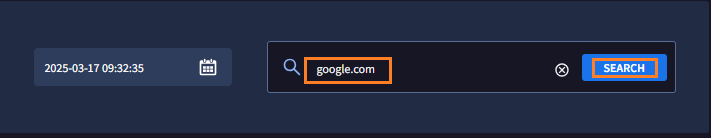
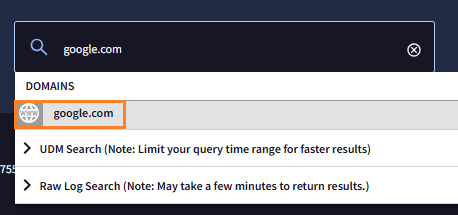

# 3. 基本操作

基本的な検索操作を通じて、SecOps コンソールの画面構成を確認します。

##  3.1 ログの検索

---

１．画面左上のメニューバーから **Investigation** > **SIEM Search** をクリックし、画面右上にある **Go to Legacy search** のリンクをクリックすると、レガシーサーチ画面に移動します。

２．レガシーサーチ画面では、 Google の検索画面に似た検索ウィンドウと、その下に現在 SecOps に格納されているログの情報が表示されています。

!!! check
    このデモ環境には約 1300 万件のログが格納されており、サイズは約 24 GBであることがわかります。

３．ここでは、格納された情報から google.com に関連するログを検索してみます。検索ウィンドウに **google.com** と入力して、右側の **SEARCHボタン** をクリックします。　

４．SecOps は入力された検索文字列がドメイン名であると判定し、検索方法の候補を表示します。**地球儀のアイコン** を選択し、ドメインによるテンプレート検索を行います。

!!! check
    その他の検索方法として、UDM Search(インデックス検索)、Raw Log search(全文検索)の候補が確認できます。

５．[次のステップ](../032-check-results) に移動して、検索結果を確認します。

