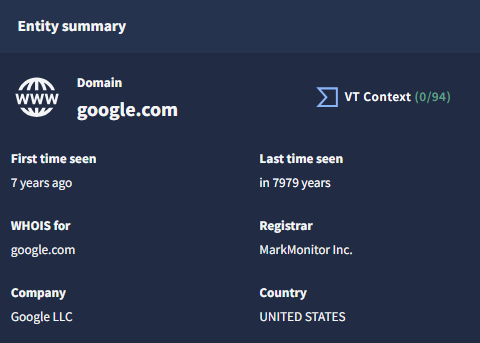
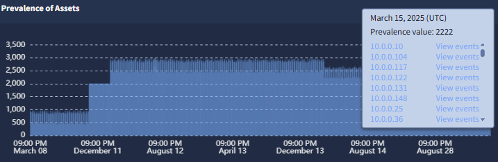
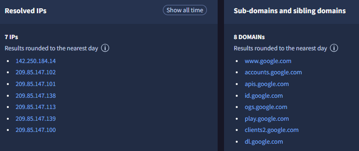
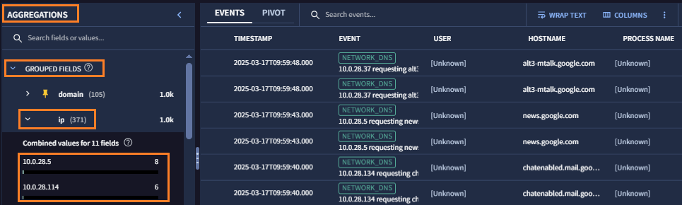
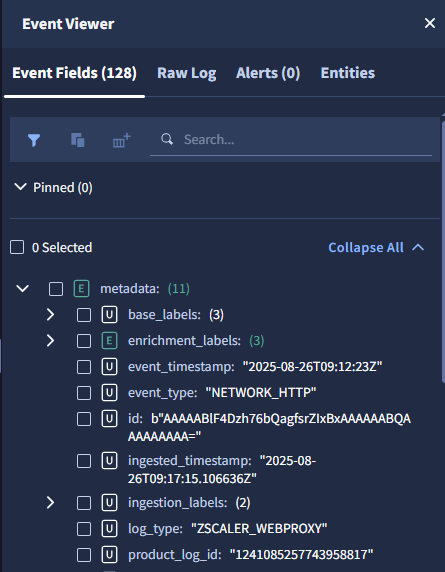

# 3. 基本操作

基本的な検索操作を通じて、SecOps コンソールの画面構成を確認します。

##  3.2  検索結果の確認

---

１．検索結果を確認します。 画面上部には`Results` や `Alerts` などのタブが並んでおり、現在は `Results` が選択されています。まず **Overview タブ** をクリックして、概要を確認します。

２．冒頭に `Gemini Summary` として Gemini による検索結果の要約が表示されています。 <u>ここで時間をとって内容を確認してください。</u>

下記のような検索結果であったことがわかります。

- 10 件程度のネットワークログとDNSログが該当し、それらは Microsoft や Zscaler, Tanium などの製品のログのようです。
- 7 件の ユーザが該当し（＝期間中にアクセスし）、あわせて一番関連が強いユーザ（Mike Ross）と弱いユーザ(Tim Smith) が表示されています。
- その他にも、ホスト名視点での要約（ 4 件）、IP アドレスベースでの要約（4件）が確認できます。

!!! check
    要約の下に `Filter out activitiy for hostname google.com`  などのボタンで表示されています。これは、追加調査を行う場合の表示フィルタ候補として Gemini が用意したものです。

３．画面下段には、`Entity summary` や `Prevalence of Assets` 、`Associated Entities` 、`Sub-domains and sibling domains` などのパネルが並んでいます。WHOIS の情報や、タイムラインでのログの分布、関連する IP アドレス、ドメイン名 が表示されています。

４．画面上部のタブに戻り **Results タブ** をクリックします。このタブでは具体的な検索結果が確認できます。

画面は３つの部分で構成されており、検索でヒットしたログについて、(a)グラフによる可視化を行う部分、(b)集計を目的とした部分、(c)個別ログを確認する部分に分かれています。

(a) の`Activity OverTime`では、トレンドが確認でき、下部のバーでズームイン/アウトが可能です。

５．(b) の`AGGREGATIONS` ウィンドウで、ログの集計情報が確認できます。**GROUP FIELDS** の **ip** をクリックして開きます。ヒットしたイベントについて ipアドレス毎の合計数が確認できます。

!!! check
    集計情報をクリックすることで、この IPアドレスのみ表示や、このIPアドレスの除外など、フィルタとして表示を絞り込むこともできます。

６．(c) の`EVENTS` ウィンドウから１つ **任意のイベント** を選択しクリックします。`EVENT VIEWER`　のウィンドウが表示されて、その中にログの詳細情報が記載されています。

!!! check
    Event Fields の画面では正規化されたログの情報が確認できます。これは SecOps がログを取り込む際に、ログの種別を判断して格納したものです。また、Raw Log のタブに移動すると、生ログの情報が確認できます。

７．画面上部に戻り、タブの **Alerts タブ** をクリックします。ヒットしたアラートが表示されるタブに移動します。
（今回はアラートがないため０件として表示されます）

８．ここまで基本的な検索操作を通じて、SecOps コンソールの画面構成を確認しました。[次のステップ](../041-template) に移動します。

