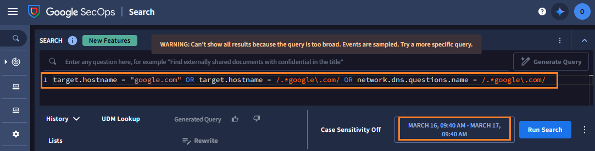
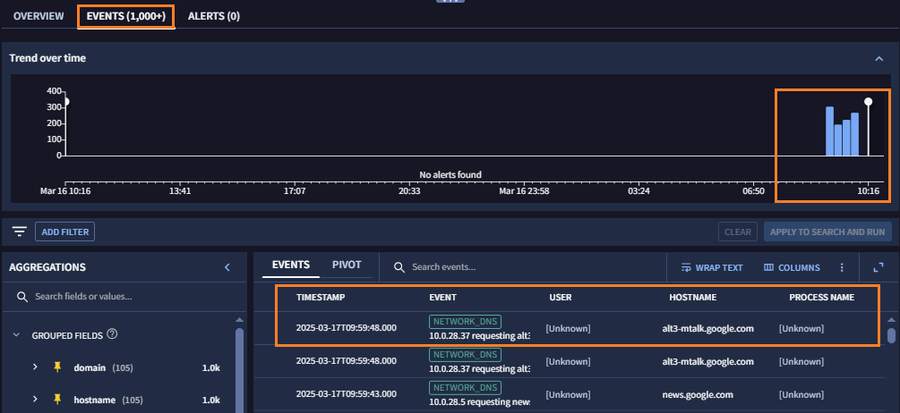
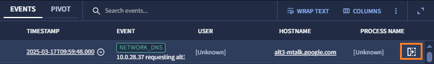
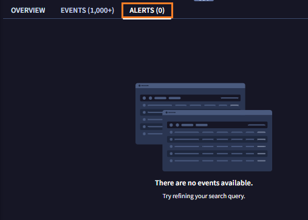

# 3. 基本操作

基本的な検索操作を通じて、SecOps コンソールの画面構成を確認します。

##  3.2  検索結果の確認

---

１．検索結果を確認します。 画面上部には、実行されたクエリと、検索対象の期間が表示されています。

!!! check
    ドメイン名でよく検索される「通信の宛先」や「DNSの名前解決」の項目が含まれたクエリになっています。また、対象期間は直近1日間で検索されたことがわかります。

２．画面中段には、`OVERVIEW` や `EVENTS` などのタブが並んでおり、現在は `OVERVIEW` が選択されています。その下には `Gemini Summary` として Gemini による検索結果の要約が表示されています。 <u>ここで時間をとって内容を確認してください。</u>

!!! check
    50 件程度のネットワークログとDNSログが該当し、それらは Microsoft や Zscaler, Tanium などの製品のログのようです。さらに、17 件の google.com 関連のドメインがあり、一番アクセスの多いドメイン ( www[.]google[.]com) や一番アクセスが少ないドメイン (youtube-ui[.]google[.]com) などが確認できます。また、7 件の ホストが関連すること（＝期間中にアクセスした）と、具体的なPC名などががわかります。

!!! check
    要約の下に `Filter to show activity for IP address xx.xx.xx.xx`  などのボタンで表示されています。これは、追加の調査を行いたい場合の表示フィルタ候補です。

３．画面下段には、`Entity summary` や `Prevalence of Assets` 、`Associated Entities` などのパネルが並んでいます。WHOIS の情報やタイムラインでのログの分布、関連する IP アドレスが表示されています。

４．画面中段のタブに戻り **Result タブ** をクリックします。検索でヒットしたログについて、時系列トレンドと、具体的な個別のログが確認できます。

５．画面左の`AGGREGATIONS` ウィンドウで、ログの集計情報が確認できます。**GROUP FIELDS** の **ip** をクリックして開きます。ヒットしたイベントについて ipアドレス毎の合計数が確認できます。

!!! check
    集計情報をクリックすることで、この IPアドレスのみ表示や、このIPアドレスの除外など、フィルタで表示を絞り込むこともできます。

６．ログの詳細を確認してみます。`EVENTS` ウィンドウから１つ **任意のイベント** を選択し、行の右側に表示された **→アイコン** をクリックします。`EVENT VIEWER`　のウィンドウが表示されて、その中にログの詳細情報が記載されています。

!!! check
    Event Fields の画面では正規化されたログの情報が確認できます。これは SecOps がログを取り込む際に、ログの種別を判断して格納したものです。また、Raw Log のタブに移動すると、生ログの情報が確認できます。

７．画面中段に戻り、タブの **Alert タブ** をクリックします。ヒットしたアラートが表示されるタブに移動します。
（今回はアラートがないため０件として表示されます）

８．ここまで基本的な検索操作を通じて、SecOps コンソールの画面構成を確認しました。[次のステップ](../041-template) に移動します。

