# 4. Gemini 活用

それでは、AI を使った活用方法を確認していきましょう。


##  4.1 脅威ハンティング

---

まず最初に、Gemini in SecOps を使った「脅威ハンティング」の方法から確認します。

「脅威ハンティング」は、攻撃者がすでに組織に侵入していないか調査する、能動的なセキュリティ運用手法の一つです。
セキュリティ対策製品のアラートを調査起点とするインシデントレスポンスとは異なり、潜在的な侵害を分析する手法です。

今回は、下記のシナリオを前提に調査を行います。

!!! note
    ある VPN 装置の脆弱性が今週明らかになり、「攻撃者 (APT41) が３ヵ月前から悪用をおこなっていた」という報道が話題になっています。この VPN 装置は自社でも利用しており、あなたは影響を懸念しています。VPN 装置のパッチ適用作業を進めていますが、脆弱性によってこの攻撃者が組織に侵入されていないかを調査したいと考えています。


１．画面左上の **Google SecOps ボタン** をクリックして、トップページに移動します。

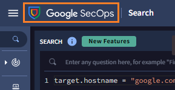


２．画面右上の **Gemini ボタン** をクリックすると、画面右にチャットウィンドウが開きます。

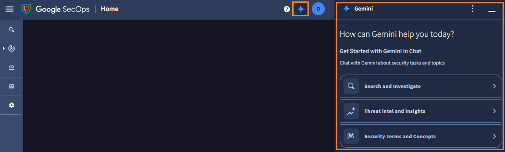

２．右下のチャットボックス (`Enter a prompt here`) に **下記のプロンプトを入力** して実行します。

``` 
APT41はこの環境で活動していますか？
```

または、

```
is APT41 active in my enviroment? 
```


!!! warning
    日本語による Gemini in SecOps へのプロンプトは、現在正式にはサポートされておりません。正しく応答するケースが多いですが、もし応答が異なる場合は、併記した英語プロンプトを試してみてください。


３．Gemini からの応答が表示されます。<u>ここで時間をとって内容を確認してください。</u>


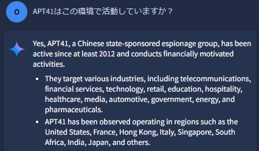

!!! check
    APT41 の説明があります。中国の関与が疑われる攻撃者グループで、2012年から活動しており、日本も攻撃対象になっています。

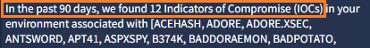

!!! check
    過去 3 か月間で 12 件、関連する通信が見つかったと報告がありました。この攻撃者に関連したマルウェア名などのキーワードが並んでいます。

４．応答の最後では、該当する通信先（ドメイン名やIPアドレス）と最後の通信時刻がまとめられています。つい最近も通信が行われているようです。

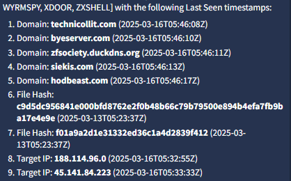


!!! tips
    ブラウザの翻訳機能を利用して、日本語で応答を確認することもできます。(Chromeブラウザでは 右クリック → T )


５．追加調査のためのアドバイスが表示されています。**Here's a search to help investigate (調査支援の検索はこちら) ボタン** をクリックします。


６．クエリが自動作成されて、SecOps で実行された結果が<u>画面左側</u>に表示されます。しばらくすると、<u>画面右側</u>のチャットウィンドウに要約が表示されます。まずこの要約から見ていきましょう。

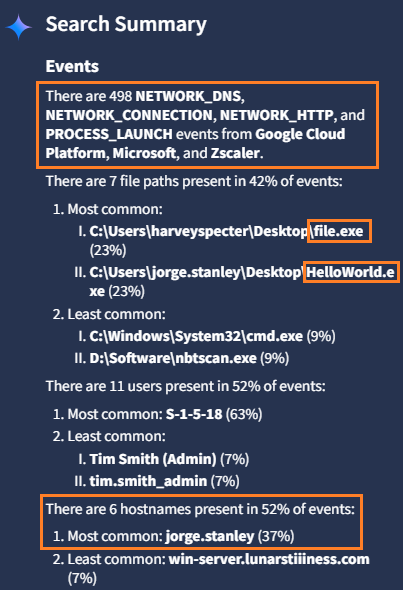


- 約500件のログが該当し、GCP や MS、Zscaler からの通信ログやプロセス実行ログが対象となっている。
- file.exe や HelloWorld.exe によって実行されている。

- 関連するホスト名は6 件あり、 jorge.stanley という端末の該当ログが一番多い。


７．画面左側を確認しておきます。左上のサーチウィンドウでは下記のクエリが自動実行されており、APT41 に関連するドメインや IP アドレスが指定されています。

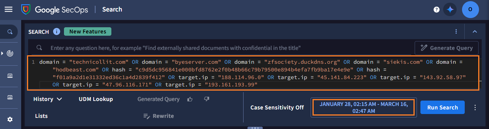


８．画面中段では、`OVERVIEW` としてGemini による先ほどの概要が確認できます。また、該当するイベント（ログ）が 約 500 件あることもわかります。

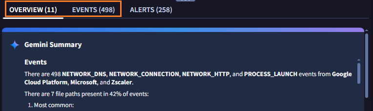


９．`Entity summary` パネルでは、APT41 に関連するIOC (IPアドレス)が表示されていて、国 や AS名などのネットワーク情報が確認できます。**VT Context** をクリックして VirusTotal の情報を確認します。

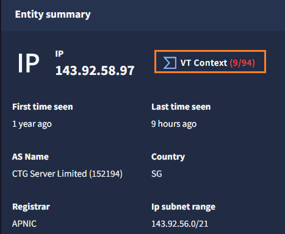


１０．VirusTotal でも「悪性のIPアドレス」と判定されていることが確認できます。


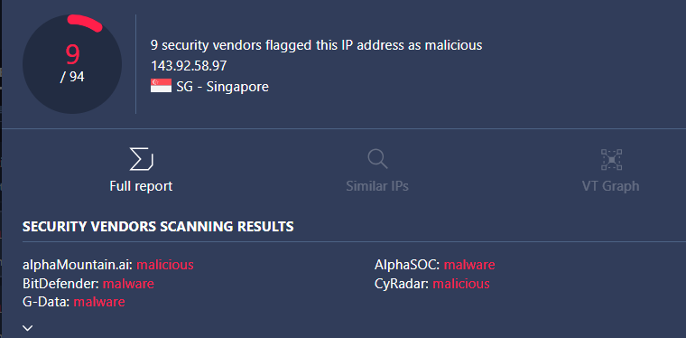


!!! check
    VirusTotal や Google Threat Intelligence ライセンスがある場合、ログインすることで詳細情報が確認できます。

１１．VirusTotal の画面を閉じて、`OVERVIEW`の画面下部を`Associated Entities`を確認すると、Geminiからの応答にあった「Jorge Stanly」が確認できます。

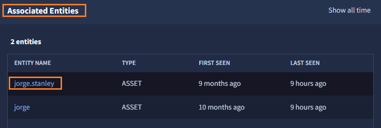


１２．Gemini を活用して、APT41に関連する「脅威ハンティング」を迅速かつ容易に行うことができました。[次のステップ](../042-create-query) に移動して、引き続き調査を行います。


