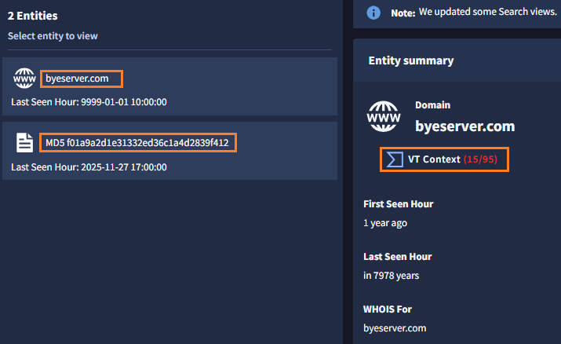
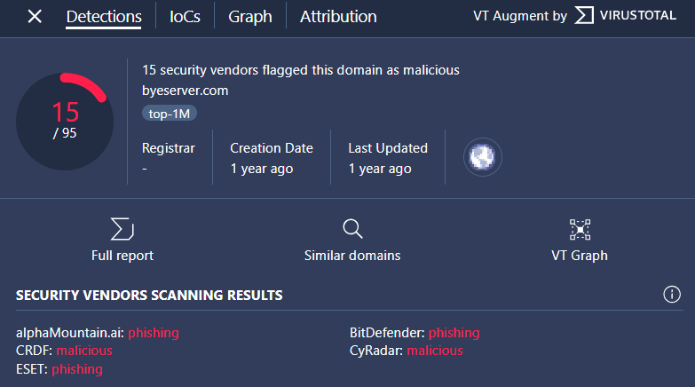

# 4. Gemini 活用

次に、Gemini in SecOps を使った「脅威ハンティング」の方法を確認します。


##  4.2 脅威ハンティング

---

「脅威ハンティング」は、攻撃者がすでに組織に侵入していないか調査する、能動的なセキュリティ運用手法の一つです。
セキュリティ対策製品のアラートを調査起点とするインシデントレスポンスとは異なり、潜在的な侵害を分析する手法です。

今回は、下記のシナリオを前提に調査を行います。

!!! note
    ある VPN 装置の脆弱性が今週明らかになり、「攻撃者 (APT41) が３ヵ月前から悪用をおこなっていた」という報道が話題になっています。この VPN 装置は自社でも利用しており、あなたは影響を懸念しています。VPN 装置のパッチ適用作業を進めていますが、この攻撃者がすでに組織に侵入していないか調査したいと同時に考えています。


１．画面左上の **Google SecOps ボタン** をクリックして、トップページに移動します。


２．画面右上の **Gemini ボタン** をクリックすると、画面右にチャットウィンドウが開きます。


２．右下のチャットボックス (`Enter a prompt here`) に **下記のプロンプトを入力** して実行します。

``` 
APT41はこの環境で活動していますか？　
```

または、

```
is APT41 active in my enviroment? 
```


!!! warning
    日本語による Gemini in SecOps へのプロンプトは、現在正式にはサポートされておりません。正しく応答するケースが多いですが、もし応答が異なる場合は、併記した英語プロンプトを試してみてください。


３．Gemini からの応答が表示されます。<u>ここで時間をとって内容を確認してください。</u>


!!! TIPS
    Gemini チャットウィンドウは、画面下の [<] ボタンで拡大ができます。また、Gemini が英語で応答した場合は、ブラウザの翻訳機能を利用で日本語で応答を確認することもできます。(Chromeブラウザでは 右クリック → T )

!!! check
    APT41 の説明があります。中国の関与が疑われる攻撃者グループで、2012年から活動しており、日本も攻撃対象になっています。


!!! check
    過去 3 か月間で 3 件、関連するログが見つかったと報告がありました。この攻撃者に関連した ドメイン名やマルウェアが並んでいます。

４．追加調査のためのアドバイスが表示されています。**Here's a search to help investigate (調査支援の検索はこちら) ボタン** をクリックします。


５．クエリが自動作成・実行された後、結果概要がチャットウィンドウに表示されます。同じ内容が<u>画面左側</u>でも確認できるので、チャットウィンドウ一度閉じて、`overview` タブで概要を確認します。


- Windows Sysmon ログでプロセス起動としてログが残っている
- ` C:\Windows\explorer.exe` によって `C:\Users\UC\Downloads\sample.exe` が実行された


６． `Entities`パネルでは、APT41 に関連するIOC (ドメイン名)がリスト表示されています。また`Entity summary`　では、各IOCについて WHOISなどの詳細情報も確認できます。**VT Context** をクリックして VirusTotal の評価も確認できます。



VirusTotal でも「悪性の高いドメイン名/ファイル」と判定されていることが確認できます。




!!! note
    VirusTotal や Google Threat Intelligence ライセンスがある場合、ログインすることで詳細情報が確認できます。

７．`Results` タブに移り、該当するログを確認します。


tim_smith_admin の端末で、この IoC に該当するファイル (nbtscan.exe) が実行されたことを示すログを発見、確認することができました。


８．Gemini を活用して APT41に関連する「脅威ハンティング」を迅速かつ容易に行うことができました。 [次のステップ](../043-create-query) に移動します。

