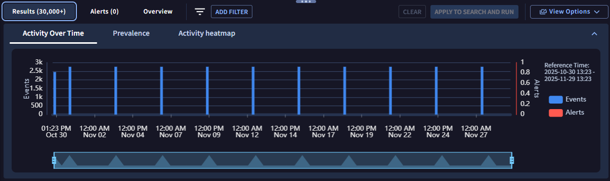

# 4. Gemini 活用

Gemini in SecOps を使った「自然言語でのログ検索」の方法を確認します。


##  4.3 ログ調査支援

---


シナリオの続きとして、関連するログが一番多かった端末 (tim.smith) を調査しましょう。

先ほどの画面から継続してログを調査することもできますが、ここでは新規に Gemini を使った検索方法を確認します。


１．画面左上の **Google SecOps ボタン** をクリックして、トップページに移動します。


２．画面右上の **Gemini ボタン** をクリックすると、画面右にチャットウィンドウが開きます。


３．右下のチャットボックス (`Enter a prompt here`) に **下記のプロンプトを入力** して実行します。

``` 
tim.smith に関連する直近１か月間のイベントを表示
```

または、

```
Show me latest 1 month events associated with tim.smith.
```


４．Gemini がクエリを作成して、チャットボックスに表示します。内容を確認して **Run Search** ボタンをクリックします。


５．クエリの実行結果が<u>画面左側</u>に表示されます。このように、Gemini チャットウィンドウ経由でもクエリを容易に実行することができます。


６．  `OVERVIEW` 画面下部の の `Entity summary` パネルで、このユーザ情報も確認できます。 勤務地や従業員番号、役職や電話番号などです。これはエンリッチ機能の一つで、 ActiveDirectory や Okta などから情報を取得したものです。このように SecOps は調査で必要となる参考情報を付加して支援することができます。


７．`Results` や `Alerts` タブに移動することで、さらに詳細を確認していくことができます。もしくは、先ほどと同じように Gemini に具体的な調査を依頼してクエリを生成することもできます。




８．「脅威ハンティング」で発見した事象に対して、追加調査も Gemini の支援を受けて進めていくことができます。実際の対応では追加調査を進めますが、今回は AI 活用の体験が目的ですので、このステップはここで終了です。 [次のステップ](../05-soar) に移動します。


