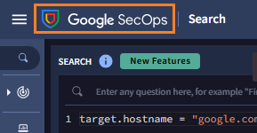

# 4. Gemini 活用

Gemini in SecOps を使った「自然言語でのログ検索」の方法を確認します。


##  4.3 ログ調査支援

---


シナリオの続きとして、関連するログが一番多かった端末 (jorge.stanley) を調査しましょう。

先ほどの画面から継続してログを調査することもできますが、ここでは新規に Gemini を使った検索方法を確認します。


１．画面左上の **Google SecOps ボタン** をクリックして、トップページに移動します。




２．画面右上の **Gemini ボタン** をクリックすると、画面右にチャットウィンドウが開きます。


３．右下のチャットボックス (`Enter a prompt here`) に **下記のプロンプトを入力** して実行します。

``` 
jorge.stanley の端末のログを3か月分、表示してください。
```

または、

```
Show me latest 3month events associated with jorge.stanley.
```


４．Gemini がクエリを作成して、チャットボックスに表示してくれます。内容を確認して **Run Search** ボタンをクリックします。


５．クエリの実行結果が<u>画面左側</u>に表示されます。このように、自然言語で調査したい内容を Gemini に伝えて、クエリを容易に実行することができます。


６．`EVENTS` や `ALERTS` タブに移動することで、通信の開始日時や詳細を確認できます。もしくは、同様に Gemini に具体的な調査を依頼してクエリを生成することもできます。


!!! check
    OVERVIEW の Entity summary パネルで、Jorge Stanly についてのユーザ情報も確認できます。 勤務地や従業員番号、役職や電話番号などです。これはエンリッチ機能の一つで、 ActiveDirectory や Okta などから情報を取得したものです。このように SecOps は調査で必要となる参考情報を付加して支援することができます。

​    


６．「脅威ハンティング」で発見した事象に対して、追加調査も Gemini の支援を受けて進めていくことができます。実際の対応であれば追加調査を進めますが、今回は AI 活用の体験が目的ですので、このステップはここで終了です。 [次のステップ](../05-soar) に移動します。


