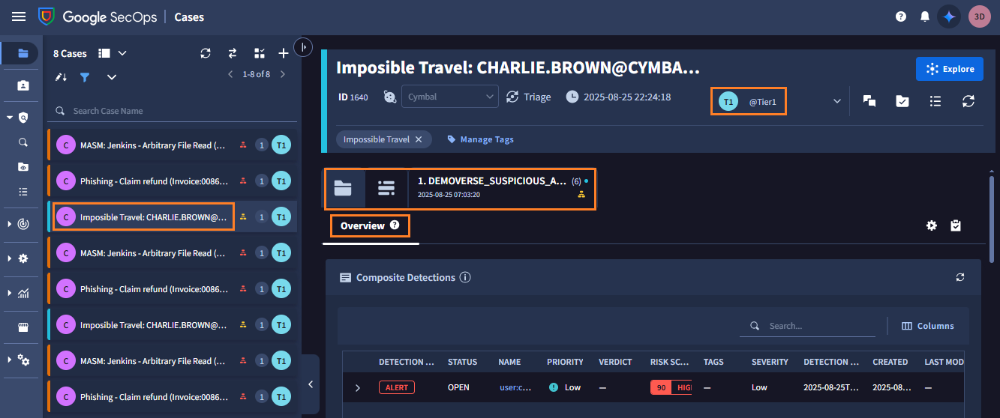
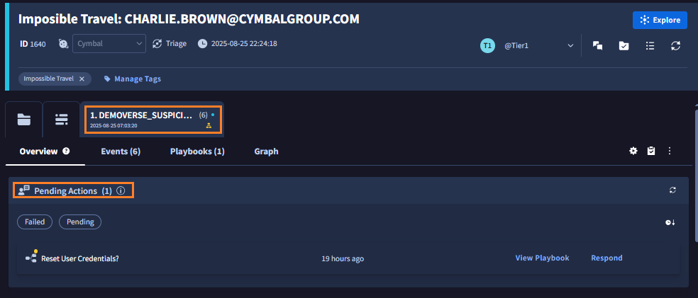
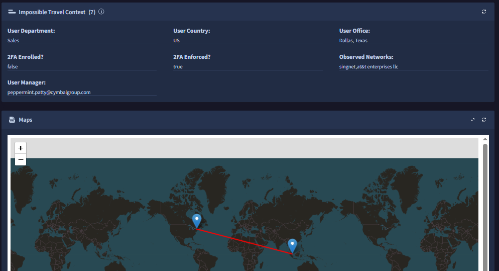

# 5. SOAR 機能

Google SecOps には 対応、復旧を効率化する SOAR の機能も含まれています。ここでは簡単にどのような機能があるかを確認します。

!!! warning
    このページはワークショップ環境では操作いただけません（環境メンテナンス中のため）。内容の確認のみ行ってください。

##  5.1 ケース管理

---

１．画面左上の **メニューボタン** から **Cases**  をクリックして、ケース管理画面に移動します。

２．左側に起票されているケースの一覧が表示されています。ここでは例として  **Imposible Travel : xxxx** のケースをクリックします。

!!! check
    このケースは Tier1 の担当者に割り当てられていることが確認できます。また画面中ではタブがあり、全体の概要(Overview)と対応履歴(Case Wall)、グループ化されたアラートが確認できるようになっています。

３．画面中段には Gemini によるケースの要約と対応方法のアドバイスが表示されています。

４．画面下段では、このケースに関連するエンティティ(IDやIPアドレスなど)の情報や、その関連性がグラフで表示されています。

５．画面上段に戻り、グループ化されたアラートをクリックします。 このケースに関して、自動対応のためのプレイブックが割り当てらていることが確認できます。

!!! check
    Pending Actions があることから、自動対応の途中で手作業の確認待ちになっているようです。

６．また画面下部では、このユーザに関するアカウント状態や、ログインが発生した具体的な場所が地図上にプロットされています。

##  5.2 プレイブックによる対応

７．  Pending Actions の **Respond** をクリックして、対応すべき内容を確認します。<u>ここでは他の参加者のために、アクションを**実行しない**でください</u>

!!! check
     このPending Actionでは、不審なログインがあったユーザのクレデンシャルの情報をリセットするために、確認メールの送信するかを確認をもとめています。

．  

８．Pending Actions の **View Playbook** をクリックすると、あらかじめ設定されたプレイブックの手順が確認できます。

!!! check
	Pending Action の前後にも、プレイブックによって動作が規定されていることを確認してください。判断を行った後も分岐した動作が用意されており、可能な限り対応を自動化できるように構築されています。

９．このステップは終了です。 [まとめ](../06-summary) に移動します。

