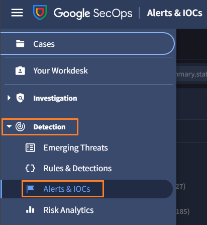
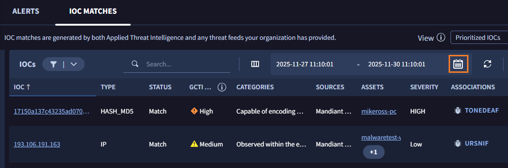

# 2. IOC Match による確認 

##  シナリオ	

---

業界 ISAC からの早期警戒情報として、下記の通知がありました。

!!! info
    UNC-AL (架空の脅威アクター)が、この業界に対して攻撃キャンペーンを活性化させています。ある ISAC 会員企業において、機密情報に対して不正アクセスを行う試みを検知、対応しました。関連する IOC を下記に共有します。
    `a1abc3d11c16ae83b9a7cf62ebe6d144dfc5e19b579a99bad062a9d31cf30bfe`

この IOC について、この環境への影響を調査していきます。

##  IoC Match 画面での確認	

SecOps には IOC 視点で状況をまとめる画面があるので、まずこちらで確認します。

１．画面左上のメニューバーから **Detection > Alerts & IOCs** をクリックして、アラート管理画面に移動します。

​	

２．上部のタブで **IOC MATCHS** をクリックします。

３．IOC MATCH の画面が表示されます。この画面では、SecOps に取り込まれたログについて「評価の悪い IOC」に合致したものを、対象端末とともに確認できます。また、重大度や攻撃者グループ、攻撃キャンペーンなどの情報も併せて表示されています。

画面上部の期間表示部分の **カレンダーアイコン** をクリックし、 **Last Month** を選択した後、 **Apply** ボタンをクリックします。

４．期間内で合致した IOC が表示されました。ここで早期警戒の IOC が含まれているかを確認します。`Search`の部分に  **a1abc3d11c16ae83b9a7cf62ebe6d144dfc5e19b579a99bad062a9d31cf30bfe**　を入力して表示を絞り込みます。

表示が０で、該当がありませんでした。この場合は下記の２つのケースが考えられます。

- IOC に関連するログがない
- IOC が評価の悪いものとして扱われていない

!!! tip
    このシナリオでは検出がありませんでしたが、IOC Match は IOC とのマッチ状況が一覧で確認でき、重大度も表示されるため優先度をつけて確認を行いたい場合に便利な画面です。

５．[次のステップ](../03-search) に移動します

