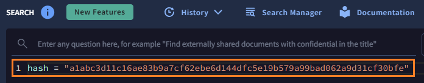
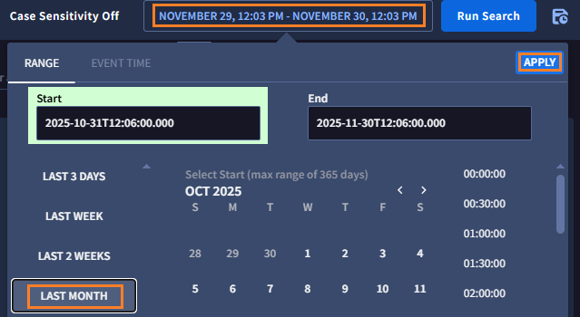

# 3. ログの調査

IOC に関連するログの有無を調査します。（今回は Gemini を利用せず直接クエリを入力します）


##  ログの有無の調査	

１．画面左上のメニューバーから **Investigation > SIEM search** をクリックして、SIEMに移動します。


２．クエリウィンドウに **下記を入力** します。

``` 
hash = "a1abc3d11c16ae83b9a7cf62ebe6d144dfc5e19b579a99bad062a9d31cf30bfe"
```



!!! check
    クエリウィンドウの入力補完機能を試してください。"h"のみ入力すると hash 以外の入力候補も確認できます


３．検索期間を「直近１ヵ月」で指定します。 **期間指定枠** をクリックし、 **LAST MONTH** を選択した後、**APPLY** をクリックします。



４．**Run Search** ボタンをクリックして、検索を実行します。


５．15 件程度のログが確認できました。また、アラートも検出されています。まず概要を確認するため **Overview タグ** をクリックして、Gemini の要約を確認してください。


６．Windows 端末のプロセス起動ログにおいて、この IOC に関連するものがあったようです。内容を確認した後、 **Alerts タブ** をクリックしてください。　 


!!! check
    このIOCで発見したログは、cmd.exe や sft.exe というファイル名、win-server といったホスト名、dan.cooper とユーザが関係しているようです。


７．Alerts タブでは、SecOps の検知ルールによって検出したアラートが確認できます。

**一番上にあるアラートの行** を選択して Alert Viewer 画面を開き、**View details ボタン** をクリックします。


８．アラートの詳細画面が表示されます。リスクスコア:95、重大度:クリティカルとして扱われています。内容を確認して、**GRAPH タブ** をクリックしてください。


!!! info
    このアラートは、 マンディアント脅威インテリジェンスの IOC と合致したため検出されています。(先ほどの IOC Match でも通常は確認できますが、シナリオ上非表示になっています）

９．GRAPH タブでは各アラートや各エンティティ（端末やユーザ）の関係が表示されます。簡単に内容を確認してください。


10．[次のステップ](../04-investigation) に移動します

